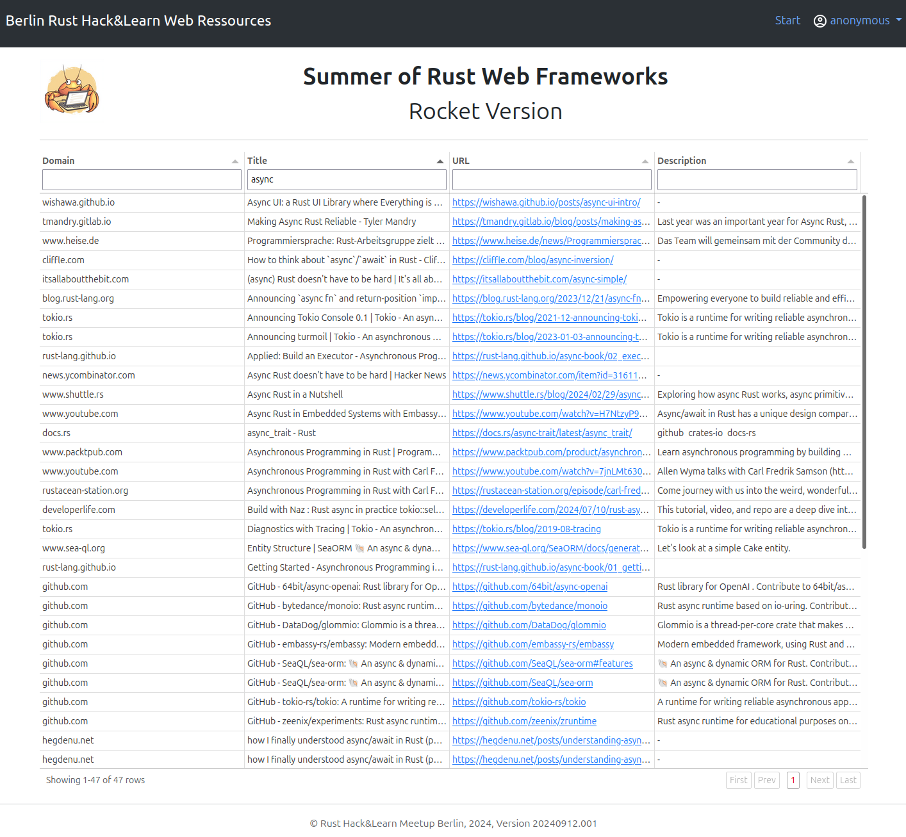

# Summer of Rust Web Frameworks

## The Berlin Rust "Hack And Learn RESsources LIBrary (halreslib)"

This is an ongoing project by the Berlin Rust Hack&Learn Meetup group: a small web application implemented in as many Rust web frameworks as possible, to help compare the vast and varied Rust web ecosystem more effectively.

## Information for contributors

This repo is only a starting point with a sample implementation of our project idea based on the Rocket webframework. We are looking for contributors, who are willing to reimplement the sample code in other Rust based webframeworks. This is not a contest and we do not care about the quality of the code provided. It is all about comparing different approaches, and getting an overview over the many Rust based webframeworks with more real-world-related information than just the "Hello World"-examples of the different crates.

For starters, our sample project generates a website, that lets the visitor search for and browse all the useful or interesting web links that we shared during our Hack and Learn sessions throughout the years.

The links are collected in a text file *exchange/urls/urls.csv*, which is updated every couple of weeks. Each entry has a date-stamp of the event, when the ressource was shared. There are duplicate entries in this file. As of April 2025 there are more than 2300 urls in the file.

I have implemented an endpoint in the webservice (*/api/import-urls*), which will parse the link-file, eliminate duplicates and crawl the URLs for additional information and availability. The results are written into an SQLite database *halreslib.sqlite* into the table *uris*. A schema of the database can be found at *_work/sql/database_scheme.sql*.

**It is not part of the project to do the webcrawling!** The idea is, that you can use the provided database "as is" for your implementation. It is just easier for me to keep the url.rs module, the link csv file(s) and some other stuff in the repository.

That being said, it is of course not illegal to implement your own webcrawler for the URLs if you like. Barafael, for example, did a much more optimized version of it, with proper concurrency and all. This was an interesting project by itself. But it is not required for our webframework comparison goal.

So far, this sample project starts a webserver with Rocket and the root endpoint delivers a webpage with a table, in which the weblinks can be searched, filtered and sorted. Information that overflows its table cell can be read in a tooltip by hovering the cursor over the cell. The frontend HTML is generated with the Tera template engine (tera support is built into Rocket). The templates can be found under *www/templates*. The webserver also delivers all static elements, like image files and Javascript stuff from the endpoint */www/static/<file..>*. The static files can be found under *www/static*.

Things are done simple: Website design is done with Bootstrap, the table is generated with the Tabulator JS framework. Those frameworks are included in *www/static*, no need to load from a CDN...

So, take what you can use, make your own version and share it with us at [Rust Berlin Hack And Learn](https://www.meetup.com/de-DE/rust-berlin/events/300820299/?eventOrigin=home_page_upcoming_events%24all)!

There are plans to extend the sample project in the future, e.g. by providing a ranking system, which will require user authentication, and more...
At some point I would like to provide the ressources library as a real permanent service.

## Common ressources

* [Flosse: Rust web framework comparison](https://github.com/flosse/rust-web-framework-comparison)
* [Luca Palmieri: Zero To Production In Rust](https://www.zero2prod.com/index.html)

## Implementations of halreslib

### Sample project: Rocket version

* https://github.com/andreasklostermaier/halreslib
* Framework: Rocket
* Database: SQLite
* Database-Handler: SQLx
* Template Rendering: Tera
* Frontend: Plain HTML

### Oxide-byte: Leptos version

* https://github.com/oxide-byte/rust-berlin-leptos
* Framework: Leptos
* Database: ???
* Database-Handler: ???
* Template Rendering: ???

### Oylenshpeegul: Axum version

* https://codeberg.org/oylenshpeegul/halres-axum-sqlx-askama
* Framework: Axum
* Database: SQLite
* Database-Handler: SQLx
* Template Rendering: Askama
* Frontend: HTMX

### Joern: Poem version (work in progress)

* https://codeberg.org/jbethune/hal-poem-openapi
* Framework: Poem OpenAPI
* Database: SQLite
* Database-Handler: Rusqlite
* Template Rendering: -
* Frontend: -

### Barafael: Dioxus version (work in progress)

* https://github.com/barafael/dioxus-halres
* https://github.com/barafael/halres-downloader
* Framework: Axum
* Database: SQLite
* Database-Handler: Rusqlite
* Template Rendering: -
* Frontend: Dioxus

